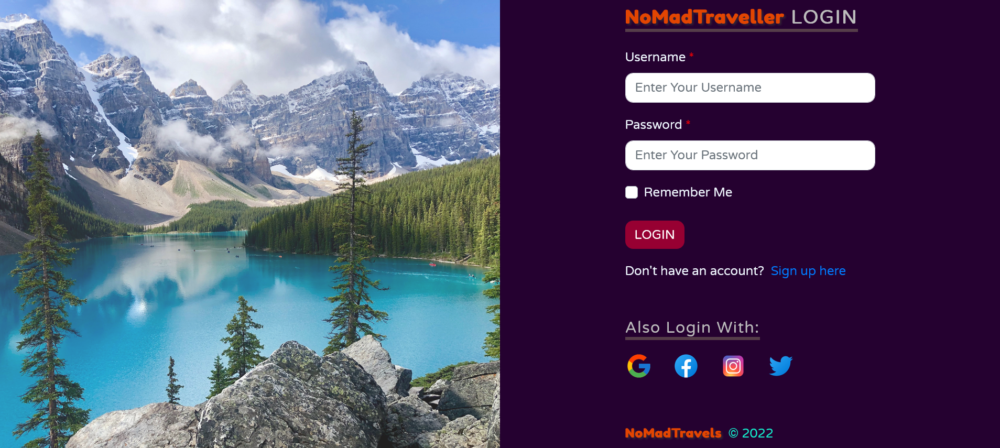

# 
 **NoMadTRAVELS (GroupProject2)** 

---

## 
 _Description_ 

Group Project 2 - To create a functional real-world full-stack application and deploy to heroku.

## 
 _Languages Used_ 

Html, CSS, Javascript, Node.js, Bootstrap, JQuery, Greensock, MySQL, Sequelize, Bcrypt, Express.js, Handlebars.js, Cloudinary

---

## _Table of Contents_

- [Installation](#Installation)
- [Usage](#Usage)
- [Links](#Links)
- [Credits](#Credits)
- [Licence](#License)
- [Badges](#Badges)
- [Questions](#Questions)
- [Tests](#Tests)

---

## _Installation_

1. Type `npm i` in terminal to install all npm dependencies from package.json. 
2. Create a `.env` file in the folder and add values for database (i.e. DB_USER, DB_PW, etc). 
3. Type `node server.js` (or 1st start mysql in terminal and type `source db/schema.sql;` followed with `show databases;` to confirm the database shows up. Then exit mysql. Now, type `npm run seed` finally followed with `npm start server`). 
4. Last, but not the least, go to a browser and type in `https://localhost/'port number'` (replace `'port number'` with a valid port#) and you should see the application. 

 

**Helpful images/gifs/video are posted below**:

## _Usage_

Simply click the deployed Heroku link (mentioned under Links section) to access the application. Thereafter, create login credentials. Once done you should be good to explore the application, post img, write comment, etc. 
Helpful images/gifs/video are posted below: 
 
Application front page preview:
 

 
 

The About Us page cards individually rotate to reveal the team members:
 

 
 

Signup & login pages:
 

 
 

## _Links_
GitHub Repo URL: https://github.com/A-N26/Proj2-TravelBlogImgHosting-
 
Deployed Heroku URL: http://www.example.com

## _Credits_

- [Mustapha TAYLOR](https://github.com/mtaylo1)
- [Chi Chiu LAM](https://github.com/chichiulam2022)
- [Wah Kong LOO](https://github.com/andyloo416)
- [Aashay NAGAR](https://github.com/A-N26)

## _License_

**(Please Click the BADGE for the license details.)**

## _Badges_

             

## _Questions_

If you would like to ask Us anything (ama, err...aua!?...) about the project, please contact us on the info mentioned below:

Contact Me

- [Mustapha taylor](https://github.com/mtaylo1), [Aashay Nagar](https://github.com/A-N26), [Chi Chiu Lam](https://github.com/chichiulam2022) & [Loo Wah Kong](https://github.com/andyloo416)

- [My e-mail](A-N26@github.com)

## _Contributing_

Please do not hesitate to fork this repo. And, there-after, submit a new branch and commit request. Once accepted, push the branch and create a pull request.

## _Tests_

n/a
